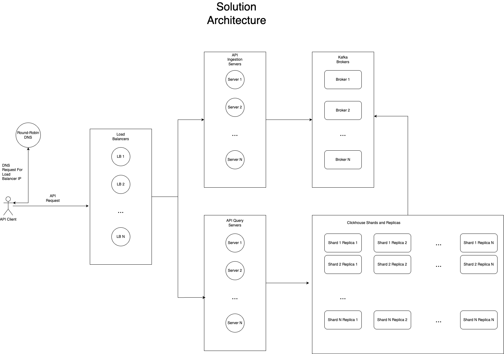

### README

### Architecture overview
<br />



<br />

##### Key components:
* __DNS service__ capable of balancing requests (Round-Robin, Geo, etc.).
* Multiple __load balancers__ reverse-proxying requests to backend API servers.
* __Ingestion__ service to process POST requests with game statistics.
* __Query__ service to process query requests.
* __Kafka__ to store events.
* __Clickhouse__ to store events projection and run analytics queries on data.

<br />

#### Design advantages:
* DNS service and load balancers provide HA.
* Kafka provides HA, fast writes of data and serves as a buffer allowing async data processing.
* Clickhouse provides data sharding, HA with replicas inside shards and fast aggregation queries on data.
* Each component may be scaled in/out independently on demand.
* Each component has clear boundaries and may be replaced with another solution.
* System is highly extensible. More functionality may be added just by adding new services reading data from kafka topic, etc.

<br />

#### Design disadvantages
* Increased operational complexity.
* Increased deployment costs.
* Some delay between posting data to server and seeing actualised data on query side (but delay is tolerable and depends on computation resources available).
In other word system is eventually consistent because of its async design.

### Running locally
<br />

#### Prerequisites
* Linux/MacOS
* Git
* Docker (Podman should do the job as well)
* JDK 21

<br />

#### Running
* Clone repo.
  ```shell
  git clone  https://
  ```
* Change working dir.
  ```shell
  cd sk-assessment
  ```
* Build docker images for backend.
  ```shell
  ./gradlew 
  ```
* Spin-up infra.
  ```shell
  docker-compose up -d kafka-init kafka-ui clickhouse-ui
  ```
* Check all services started successfully and are healthy.
  ```shell
  docker-compose ps
  ```
* Spin-up backend.
  ```shell
  docker-compose up -d load-balancer
  ```
* Check all services started successfully and are healthy.
  ```shell
  docker-compose ps
  ```
